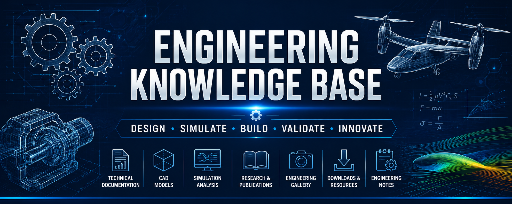

<!-- =============================================================== -->
<!--                    ENGINEERING PORTFOLIO                        -->
<!-- =============================================================== -->

  

<h1 align="center">Engineering Portfolio</h1>

<h3 align="center">
Design • Simulate • Build • Validate • Innovate
</h3>

---

# 👋 Welcome

Welcome to my Engineering Portfolio.

This repository is the central resource hub for the engineering work presented throughout my GitHub profile.

Rather than duplicating the information available in my individual project repositories, this portfolio focuses on the engineering assets that support those projects—including technical documentation, CAD resources, simulation results, research publications, presentations, downloadable materials, and development records.

Its purpose is to provide recruiters, researchers, students, and collaborators with a structured view of the engineering process behind my work while keeping project implementations organized within their respective repositories.

---

# 📖 Repository Purpose

This repository complements my GitHub profile by organizing the engineering resources that extend beyond source code and project repositories.

It serves as a centralized archive for technical documentation, engineering references, design assets, simulation outputs, publications, and downloadable materials, making it easier to explore the complete engineering workflow behind my projects.

---

> *"Engineering is not only about building systems—it's about understanding problems, validating solutions, and continuously improving through innovation."*

---

**⬇ Continue below to explore the Engineering Resource Center ⬇**

---
<!-- =============================================================== -->
<!--                    DOWNLOAD & RESOURCE HUB                      -->
<!-- =============================================================== -->

# 📥 Download Center

Everything in this section is available for viewing or downloading.

| Resource | Description | Access |
|----------|-------------|--------|
| 📄 Resume | Latest professional resume | **[View Resume](downloads/Resume.pdf)** |
| 🎓 Bachelor's Thesis | Design and Development of a Fixed-Wing VTOL UAV with Tilt-Rotors | **[Read Thesis](downloads/Thesis.pdf)** |
| 📊 Project Presentation | Final thesis presentation slides | **[Open Presentation](downloads/Presentation.pdf)** |
| 📜 Professional Certificates | Technical and professional certifications | **[View Certificates](downloads/Certificates.pdf)** |
| 📚 IEEE Conference Paper | Control System Design of a Fixed-Wing VTOL UAV (ECCE 2025) | **[View on IEEE Xplore](https://ieeexplore.ieee.org/document/11013869)** |

---

# 🌐 Professional Profiles

---

> **Looking for complete project implementations?** Visit my **[Main GitHub Profile](https://github.com/mdlaisurrahmankhanturjo)**, where each engineering project is maintained in its own dedicated repository with source files, documentation, and development history.

---
<!-- =============================================================== -->
<!--                 ENGINEERING PROJECT DIRECTORY                   -->
<!-- =============================================================== -->

# 🗂 Engineering Project Directory

The projects below are maintained in their own dedicated repositories, each containing source files, engineering documentation, design files, analyses, and development history.

| Project | Description | Repository |
|---------|-------------|------------|
| ✈️ **Fixed-Wing VTOL UAV** | Design and Development of a Fixed-Wing VTOL UAV with Tilt-Rotors | **[Open Repository](https://github.com/mdlaisurrahmankhanturjo/fixed-wing-vtol-uav)** |
| 🤖 **Hybrid Dual-Rotation Actuator** | Dual Dynamixel MX-64 based mechanical actuator | **[Open Repository](https://github.com/mdlaisurrahmankhanturjo/hybrid-dual-rotation-actuator)** |
| ⚙️ **Stress-Optimized Compound Gearbox** | CAD modeling and finite element optimization of a compound gearbox | **[Open Repository](https://github.com/mdlaisurrahmankhanturjo/stress-optimized-compound-gearbox)** |
| 🌞 **Hybrid Solar–Wind Power Plant** | Renewable energy system design and optimization using HOMER Pro | **[Open Repository](https://github.com/mdlaisurrahmankhanturjo/hybrid-solar-wind-power-plant)** |
| 🌫️ **Smart Air Quality Monitoring System** | Arduino and IoT based real-time environmental monitoring system | **[Open Repository](https://github.com/mdlaisurrahmankhanturjo/smart-air-quality-monitoring-system)** |

---

# 📚 Research & Publications

### IEEE Conference Publication

**Control System Design of a Fixed-Wing VTOL UAV**

- **Conference:** 2025 International Conference on Electrical, Computer and Communication Engineering (ECCE)
- **Publisher:** IEEE
- **DOI:** 10.1109/ECCE.2025.11013869

📖 **Read the paper:**  
https://ieeexplore.ieee.org/document/11013869

---

# 🌐 Professional Profiles

| Platform | Link |
|----------|------|
| 💻 GitHub | https://github.com/mdlaisurrahmankhanturjo |
| 💼 LinkedIn | https://www.linkedin.com/in/md-laisur-rahman-khan-turjo |
| 🔬 ResearchGate | https://www.researchgate.net/profile/Laisur-Turjo |

---

> *Each repository is continuously updated as new features, analyses, documentation, and improvements are completed.*

---
<!-- =============================================================== -->
<!--                      PORTFOLIO FOOTER                           -->
<!-- =============================================================== -->

# 🤝 Let's Connect

If you're interested in my engineering projects, research, or would like to discuss potential collaborations, feel free to connect with me through the platforms below.

---

## 📌 Portfolio Summary

This Engineering Portfolio complements my GitHub profile by organizing the resources behind my engineering work. It serves as a central archive for technical documentation, CAD models, engineering analyses, research publications, presentations, and downloadable materials, while each individual repository contains the complete implementation and development history of a specific project.

Thank you for visiting my portfolio.

---

**Designed and maintained by**

### Md Laisur Rahman Khan Turjo

Mechanical Engineer • UAV Systems • Robotics • CAD & Engineering Simulation

⭐ If you found this portfolio helpful, consider following my GitHub profile to stay updated with future engineering projects and research.

